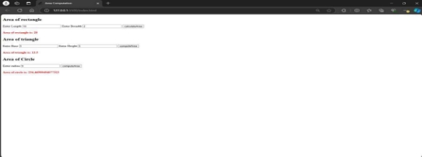
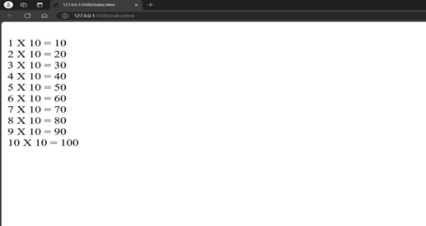
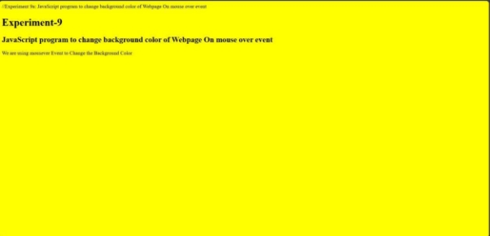

Exp no:1 

/\*HTML CODE\*/ 

<!DOCTYPE html> 

<html lang="en"> 

<head> 

<title>Area Computation</title>

</head> 

<body> 

<h2>Area of rectangle</h2>

<label for="length">Enter Length</label>

<input type="number" name="length" id="rectLen">

<label for="breadth">Enter Breadth</label>

<input type="number" name="breadth" id="rectBre">

<button type="submit" onclick="areaOfRectangle()">calculateArea</button> <h4 id="rectarea" style="color: red">Area of rectangle is: ?</h4>

<h2>Area of triangle</h2>

<label for="base">Enter Base</label>

<input type="number" name="base" id="triBase">

<label for="height">Enter Height</label>

<input type="number" name="height" id="triHei">

<button type="submit" onclick="areaOfTriangle()">computeArea</button> <h4 id="triarea" style="color: red">Area of triangle is: ?</h4>

<h2>Area of Circle</h2>

<label>Enter radius</label>

<input type="number" id="radius">

<button type="submit" onclick="areaOfCircle()">computeArea</button> <h4 id="circlearea" style="color: red">Area of circle is: ?</h4>

</body> 

</html> 

//JS CODE 

function areaOfRectangle() { 

var a = parseFloat(document.getElementById('rectLen').value); 

var b = parseFloat(document.getElementById('rectBre').value); 

var area = a \* b; 

document.getElementById("rectarea").innerHTML = "Area of rectangle is: " + area; } 

function areaOfTriangle() { 

var a = parseFloat(document.getElementById('triBase').value); 

var b = parseFloat(document.getElementById('triHei').value); 

var area = 0.5 \* a \* b;

document.getElementById("triarea").innerHTML = "Area of triangle is: " + area;

} 

function areaOfCircle() { 

var r = parseFloat(document.getElementById('radius').value); 

var area = Math.PI \* r \* r;

document.getElementById("circlearea").innerHTML = "Area of circle is: " + area;

} Output 

EXP NO 2: 

//CODE 

<!DOCTYPE html> 

<html> 

<head> 

<title>First multiplication table</title>

 

</head> 

<body> 

<label for="text">Enter the no:</label> 

<input type="number" id="no1"> 

<button onclick="mul(no1.value)">multiplication table</button> </body> 

</html> 

Output: 

EXP NO: 3 

//CODE : 

<!DOCTYPE html> 

<lang="en"> 

<head> 

<title>String Operations</title>

</head> 

<h1>String Operations</h1>

  

<label for="str">Enter the string </label>

<input type="text" name="str" id="str"/>

<h2>String Reversal using FOR Loop</h2>

<button type="submit" onclick="revStrUsingFor()">Reverse String</button> <h4 style="color:red" id="revfor">Reverse string is? </h4>

  

<h2>String Reversal using recursive function</h2>

<button type="submit" onclick="var x = revStrRecursive(); document.getElementById('revrec').innerHTML = 'Reverse string is: ' + x;">Reverse String</button> 

<h4 style="color:red" id="revrec">Reverse string is? </h4>

  

<h2>String Reversal using in-built functions</h2>

<button type="submit" onclick="revStrInbuiltFunc()">Reverse String</button> <h4 style="color:red" id="revinbuilt">Reverse string is? </h4>

  

<h2>String Palindrome</h2>

<button type="submit" onclick="strPalindrome()">Check String</button> <h4 style="color:red" id="strPalin">Given string is? </h4>

  

<h2>Replace characters of string</h2>

<label for="match">Enter match/characters to be replaced from string:</label> <input type="text" name="match" id="match"/>

  

  

<label for="pattern">Enter pattern/characters to be added into string:</label>

<input type="text" name="pattern" id="pattern"/>

<input type="text" name="pattern" id="pattern"/>

  

  

<button type="submit" onclick="strReplace()">Replace</button>

<h4 style="color:red" id="strrep">String replacement using replace() method: ? </h4>

<h4 style="color:red" id="strrepall">String replacement using replaceall() method: ? </h4> 

 </body> </html> 

//OUTPUT: 

<!DOCTYPE html> 

<html lang="en"> 

<head> 

<meta charset="UTF-8">

<meta name="viewport" content="width=device-width, initial-scale=1.0"> <title>String Comparison</title>

</head> 

<body> 

<h1>String Comparison Using Various Methods</h1>

Open the browser console to see the results of the string comparison.
  

</body> 

</html> 

OUTPUT : 

EXP NO: 5 

<!DOCTYPE html> 

<html lang="en"> 

<head> 

<meta charset="UTF-8">

<meta name="viewport" content="width=device-width, initial-scale=1.0"> <title>Countdown Timer</title>

</head> 

<body> 

<h1>Countdown Timer</h1>

 

</body> 

</html> 

//OUTPUT: 

Exp No:8 

<!DOCTYPE html> 

<html lang="en"> 

<head> 

<meta charset="UTF-8">

<meta name="viewport" content="width=device-width, initial-scale=1.0"> <title>Set Operations</title>

</head> 

<body> 

<h1>Set Operations</h1>

<!-- Section for Union --> 

<h3>Union of two sets</h3>

<!-- Section for Intersection -->

<h3>Intersection of two sets</h3>

<!-- Section for Difference -->

<h3> Difference of two sets</h3>

</body> </html> 

Output: 

Exp no: 7b 

Code: 

<!DOCTYPE html> 

<html lang="en"> 

<head> 

<meta charset="UTF-8">

<meta name="viewport" content="width=device-width, initial-scale=1.0"> <title>Add Element to Array using Splice Method</title>

 

</head> 

<body> 

<h1>GeeksforGeeks</h1> 

Click the button to add new elements to the array.

<!-- Button to trigger spliceFunction -->

<button onclick="spliceFunction()">Add Elements</button>

<!-- Display array here -->

 

</body> 

</html> 

Output: 

<!DOCTYPE html> 

<html lang="en"> 

<head> 

<meta charset="UTF-8">

<meta name="viewport" content="width=device-width, initial-scale=1.0"> <title>Append Object to Array and Check if Object is an Array</title>

 

</head> 

<body> 

<h1>Append Object to Array and Check if Object is an Array</h1>

<!-- Sections to display results -->

<strong>Check  if  object  is  an  array:</strong>  
 

<strong>Array  after  inserting  object:</strong>  
 

 

</body> 

</html> 

<!DOCTYPE html> 

<html lang="en"> 

<head> 

<meta charset="UTF-8">

<meta name="viewport" content="width=device-width, initial-scale=1.0"> <title>Remove Array Element</title>

</head> 

<body> 

<h1>Remove Array Element Example</h1>

<strong>Original Array:</strong> [1, 2, 3, 4, 5]

<strong>After removing 2:</strong> 
 
<strong>Original Array:</strong> [2, 5, 9, 6]

<strong>After removing 5:</strong> 
  

</body> 

</html> 

Output : 

Code: 

<!DOCTYPE html> 

<html lang="en"> 

<head> 

<meta charset="UTF-8">

<meta name="viewport" content="width=device-width, initial-scale=1.0"> <title>Array Manipulation</title>

</head> 

<body> 

<h1>Array Manipulation Experiments</h1>

<h2>Checking if an array contains a specified value</h2>

<h2>Emptying an array using three methods</h2>

Original array: [1, 2, 3]

<strong>Method 1 (Substitution):</strong> 
 

<strong>Method 2 (Splice):</strong> 

<strong>Method 3 (Set length to 0):</strong> 
 

 

</body></html> 

EXP No:9 

Code : 

//Experiment 9a: JavaScript program to change background color of Webpage On mouse over event

<!DOCTYPE html> 

<html lang="en"> 

<head> 

<meta charset="UTF-8"> 

<meta http-equiv="X-UA-Compatible" content="IE=edge"> 

<meta name="viewport" content="width=device-width, initial-scale=1.0"> <title>Experiment-9</title> 

 

</head> <body> 

<h1 id="head1" onmouseover="changeColor1()" onmouseout="changeColor2()"> Experiment-9</h1> 

<h2> JavaScript program to change background color of Webpage On mouse over event</h2> 

We are using mousever Event to Change the Background Color
 

</body> </html> 

Js Code: 

function changeColor1() { 

document.body.style.backgroundColor = "red";

} 

function changeColor2() { 

document.body.style.backgroundColor = "yellow";

} 
Output : 

Exp no:9b 

//Experimen-9b: Program to change Background color using onfocus event <!DOCTYPE html> 

<html lang="en"> 

<head> 

<meta charset="UTF-8">

<meta http-equiv="X-UA-Compatible" content="IE=edge">

<meta name="viewport" content="width=device-width, initial-scale=1.0"> <title>Experiment-9b</title> 

</head> 

<body> 

<h1>Experimen-9b</h1> 

 In this Program we are going to change the Background color of document when onfocus event is occured
 

<h2>Student Information Form</h2>

<form id="myForm"> 

<label> Student Name: <input type="text" id="myInput">  </label> </form> 

</body> 

</html> 

JS code: 

var x = document.getElementById("myForm"); x.addEventListener("focus", myFocusFunction, true); x.addEventListener("blur", myBlurFunction, true); 

function myFocusFunction() { 

document.getElementById("myInput").style.backgroundColor = "yellow";

} 

function myBlurFunction() { 

document.getElementById("myInput").style.backgroundColor = ""; } 

Output : 

Exp no 10 

Html code: 

<!DOCTYPE html> 

<html lang="en"> 

<head> 

<meta charset="UTF-8">

<meta http-equiv="X-UA-Compatible" content="IE=edge">

<meta name="viewport" content="width=device-width, initial-scale=1.0"> <title>Document</title> 

</head> 

<body> 

<h1>Experiment-10</h1> 

<h2>Form Validation Example</h2>

  

<h1>Sign Up Form</h1>

<form name="myForm" action="/thankyou.html" onsubmit="return validate()" >

<label for="fname"> First name</label>

<input type="text" id="fname" name="fname" placeholder="Enter First Name" 

required> 

<label for="lname">Last Name</label>

<input type="text" id="lname" name="lname" placeholder="Enter Last Name" >   

  

<label for="usremail">Email</label>

<input type="email" id="usremail" name="usremail" placeholder="Enter Email here"

\> 

<label for="usrpassword">Password</label>

<input type="password" id="usrpassword" name="usrpassword" placeholder="Enter Password" > 

    

Gender ?

<label for="male"> Male</label>

<input type="radio" id="male" name="option"> <label for="female"> Female </label>

<input type="radio" id="female" name="option"> 

 

<label for="usrmobile">Mobile Number</label>

<input type="text" id="usrmobile" name="usrmobile" placeholder="Mobile Number" required> 

 

<input type="submit" name="" id="" value="submit"> </form> 

</body> 

</html> 

JS code: 

function validate() { 

var firstName = document.myForm.fname.value; 

var lastName = document.myForm.lname.value;

var userpassword = document.myForm.usrpassword.value; var usrmobile = document.myForm.usrmobile.value; console.log(firstName); 

console.log(lastName); 

console.log(userpassword); 

console.log(usrmobile); 

if (firstName == null || firstName == "" || firstName.length<3 ) { 

alert("First Name can't be blank or Less than 3 Charecter"); document.myForm.fname.focus(); 

return false; 

} 

if (lastName == null || lastName == "") { 

alert("Last Name can't be blank"); document.myForm.lname.focus(); 

return false; 

} 

if (userpassword.length < 6) {

alert("Password must be at least 6 characters long."); document.myForm.usrpassword.focus(); 

return false; 

} 

if (isNaN(usrmobile)) { 

alert("Enter Numeric value only"); document.myForm.usrmobile.focus(); 

return false; 

} 

return true; 

} 

Output : 

